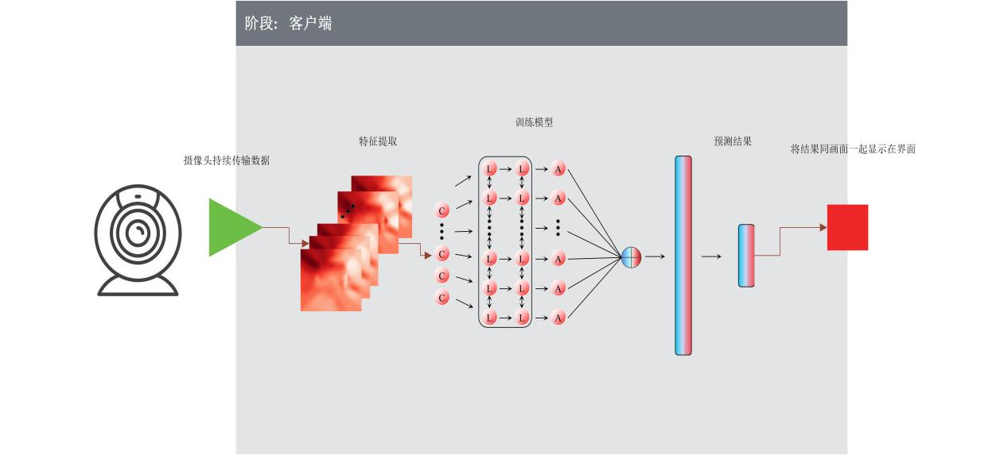
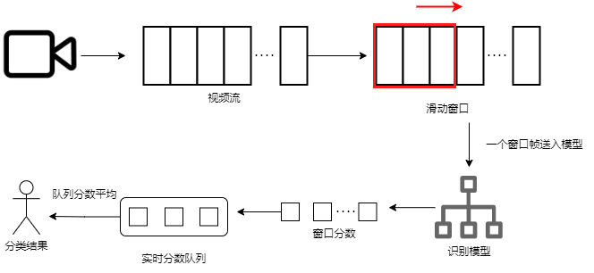
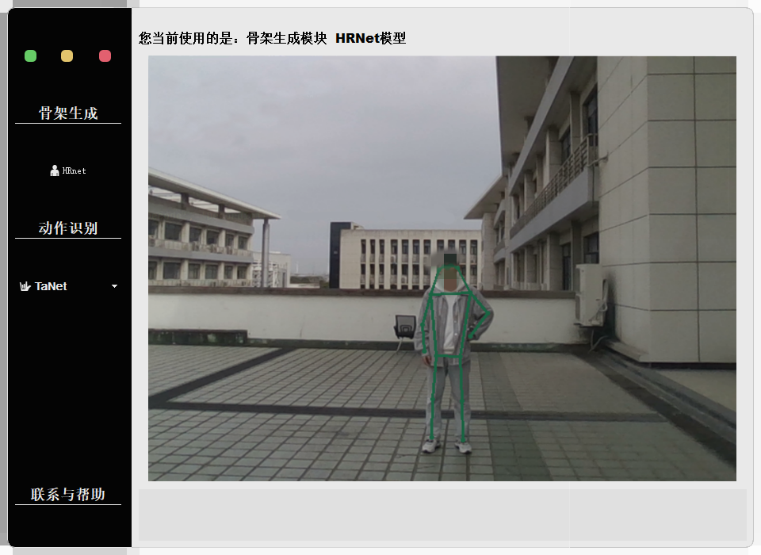
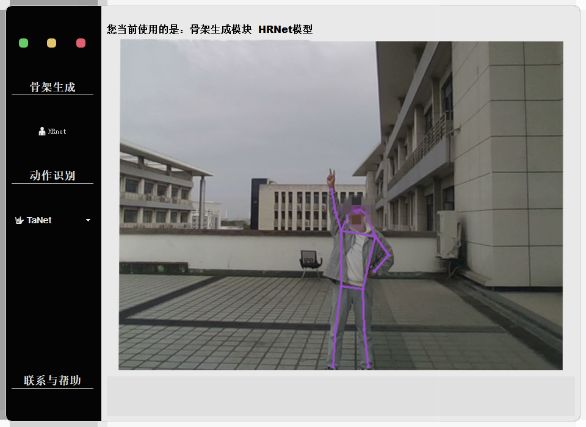

# 人体骨架动作识别系统
该系统能够实现观演空间下的实时动作识别和骨架检测，具体来说可以通过部署电脑的摄像头识别视频画面中的人物动作同时生成对应人物的2维人体骨架坐标点。

其封装了mmaction2的识别框架，在动作识别上使用了TaNet，TSN，TimesFormer三个方法，在骨架检测上使用HRnet这个方法。

### 大致架构如下图所示

### 具体的实现流程（实时识别）：

### 系统界面

骨架生成

动作识别

